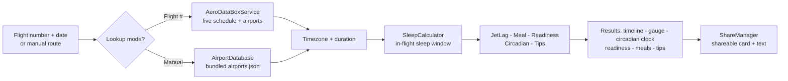

<div align="center">

# ✈️ Jetter

### Turn any long-haul flight into a jet-lag battle plan.

Jetter is a SwiftUI iOS app that fuses route data, timezone math, and sleep-cycle timing into a personalized in-flight sleep schedule, meal plan, and recovery strategy — so you land ready, not wrecked.


</div>

---

## ✨ What it does

Give Jetter a flight — by number or by hand — and it builds a complete circadian game plan around it:

- 🛫 **Two ways to plan** — look up a flight by number + date (AeroDataBox via RapidAPI), or enter the route manually with **no API key required**.
- 😴 **Timezone-aware sleep window** — places a realistic in-flight sleep block based on route, duration, direction (eastbound vs westbound), and arrival timezone.
- 📊 **Jet-lag severity + recovery estimate** — scores how rough the shift will be and how long recovery will take.
- 🍽️ **Meal-timing guidance** — schedules meals around your sleep block.
- ✅ **Travel-readiness score** — plus a pre-flight preparation timeline for the days before you fly.
- 🕑 **Circadian timeline** — a visual clock of your body clock vs. destination time, with a sleep-pressure curve.
- 📤 **Shareable plan** — generates a text summary and a rendered SwiftUI share card.
- 💾 **Local-first** — saved flights persist on-device as JSON, and manual mode works fully offline.

## 🧭 How a plan comes together



## 🧰 Tech stack

| Area | Details |
|---|---|
| **UI** | SwiftUI, `@Observable` state, a custom design system (colors, typography, components, shapes, animations), haptics |
| **Data** | Foundation networking (`NetworkClient`), local JSON persistence, bundled `airports.json` |
| **Integrations** | AeroDataBox (RapidAPI) for live flight lookup; UIKit interop for the share sheet |
| **Platform** | iOS 26.2 target · Swift 5 · Xcode |

## 🏛️ Architecture

A clean split between views, view models, domain models, and a calculation/networking service layer:

```
Jetter/
├── Views/          # FlightList · Input · Onboarding · Results · CircadianTimeline
├── ViewModels/     # flight input state + result composition
├── Models/         # Airport · FlightInfo · SleepSchedule · JetLagSeverity · ...
├── Services/       # the brains (see below)
├── DesignSystem/   # colors · typography · components · shapes · animations
└── Resources/      # airports.json (bundled airport dataset)
```

**The service layer does the heavy lifting:**

| Service | Responsibility |
|---|---|
| `SleepCalculator` | core in-flight sleep-window calculation |
| `JetLagCalculator` | timezone-shift severity + recovery estimate |
| `MealServiceCalculator` | meal scheduling around the sleep plan |
| `ReadinessCalculator` | travel-readiness scoring |
| `PreFlightPreparationCalculator` | pre-trip preparation timeline |
| `CircadianCalculator` | body-clock timeline + sleep-pressure curve |
| `AeroDataBoxService` | live flight lookup (cached per session) |
| `AirportDatabase` | bundled airport search + API fallback |
| `FlightStore` | on-device saved-flight persistence |
| `ShareManager` | share text + rendered card image |

## 🚀 Getting started

**Requirements:** macOS + Xcode, and an iOS 26.2 simulator or device.

```bash
git clone https://github.com/shinic1/Jetter.git
open Jetter/Jetter.xcodeproj
```

Pick a simulator and run the **Jetter** scheme.

### Optional: live flight lookup

Manual mode needs no key. To enable flight-number lookup:

1. Copy `Jetter/Configuration/APIKeys.plist.example` → `APIKeys.plist`.
2. Set `AeroDataBoxKey` to a valid AeroDataBox RapidAPI key.
3. Build & run.

> 🔒 `APIKeys.plist` and `Secrets.xcconfig` are gitignored and excluded from target membership — never commit real credentials.

---

<div align="center">

Built by <b>Nico Bourel</b> · <a href="https://swedev.online">swedev.online</a>

</div>
